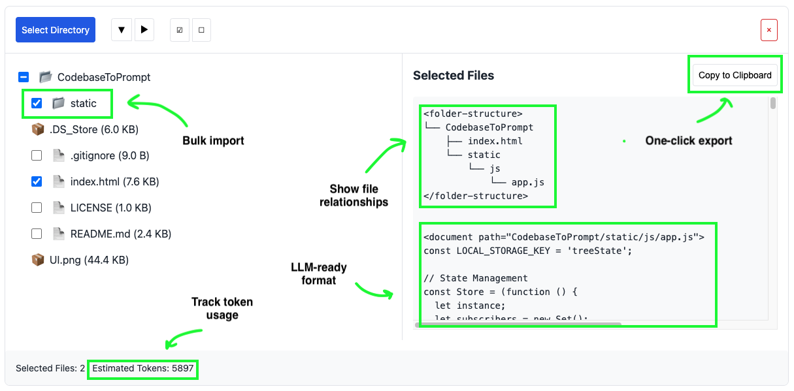

# CodebaseToPrompt

A simple tool that converts your local directory into a structured prompt for Large Language Models (LLMs). It helps you pick which files to include or ignore, then outputs everything in a format you can copy directly into an LLM for code review, analysis, or documentation.

[](https://path-find-er.github.io/CodebaseToPrompt/)

Try it here: [CodebaseToPrompt Web App](https://path-find-er.github.io/CodebaseToPrompt/)

---

## Overview

**CodebaseToPrompt** scans your chosen folder right in the browser (no files are uploaded anywhere) and builds a file tree. You can expand folders, see which files are text or code, and select only what you need. The selected files are then compiled into a snippet of structured text, which you can copy for use with an LLM.

---

## Features

- **Interactive File Tree**  
  Explore and expand your local folders in a simple interface.

- **File Filtering**  
  Automatically ignores system or binary files (e.g., `.DS_Store`, `node_modules`, images, videos).

- **Local Storage**  
  Your selections are remembered so you can pick up where you left off.

- **LLM-Ready Output**  
  Generates a format that's easy to paste into chatbots and other AI tools.

- **Token Count Estimate**  
  Provides a rough calculation of how many tokens the selected content might use.

- **Flexible Text Selection**  
  Choose between selecting text or copying directly to clipboard, ensuring compatibility with both HTTP and HTTPS environments.

---

## How to Use

1. **Open the App**  
   Clone this repository, then open `index.html` in a modern browser (Chrome or Firefox recommended).

   ```bash
   git clone https://github.com/path-find-er/CodebaseToPrompt.git
   ```

2. **Select Your Folder**  
   Click “Select Directory” to choose the folder you want to analyze.

3. **Pick Files**  
   Expand or collapse directories. Check or uncheck files to decide what gets included.

4. **Copy or Select Text**  
   View or copy your selected files in the generated prompt format by clicking “Copy to Clipboard” or “Select Text” (the latter is useful in HTTP-only environments).

---

## Docker Quickstart

For a self-contained deployment, you can use the included **Dockerfile**:

```bash
# Build the Docker image
docker build -t codebasetoprompt .

# Run the container (maps container port 80 to host port 8080)
docker run -d -p 8080:80 codebasetoprompt

# Then open http://localhost:8080
```

> **Note:** This simply serves the static files using `nginx:alpine`. If you prefer GitHub Pages or other hosting, you can ignore Docker.

---

## Use Cases

- Creating context for AI-based code review or Q&A  
- Quickly extracting only the important parts of a large project for analysis  
- Preparing short or large code snippets for LLM debugging  
- Generating reference material for new developers or documentation

---

## Configuration

Certain folders and file types are automatically ignored (e.g., `node_modules`, `.git`, `venv`, common binary files). You can modify the lists inside the JavaScript code (`app.js`) if you need more control.

---

## Browser Support

- Chrome/Chromium (recommended)  
- Edge  
- Firefox  
- Safari (basic directory selection may vary)

---

## Contributing

Contributions are welcome! Feel free to open issues for bugs or requests. For major changes, create an issue to discuss them first.

1. Fork and clone the repo
2. Make your changes in a branch
3. Open a Pull Request describing your updates

---

## License

[MIT](LICENSE)

---

## Acknowledgments

- Built with vanilla JavaScript and Web APIs
- Uses [SheetJS](https://sheetjs.com/) for spreadsheet parsing
- Uses [PDF.js](https://mozilla.github.io/pdf.js/) for PDF parsing

---

## Contact

- Open an issue on GitHub for ideas or bug reports  
- Submit a Pull Request for direct contributions  
- Reach out via the repo's issues page if you have questions